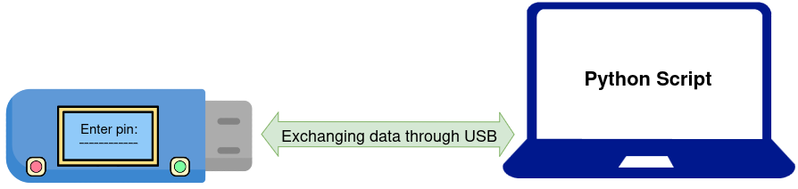
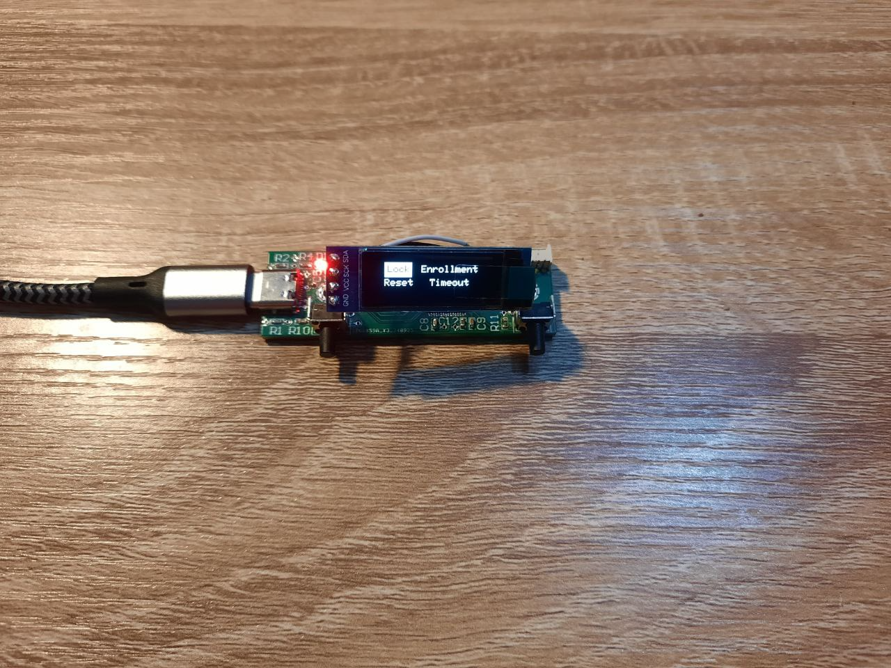
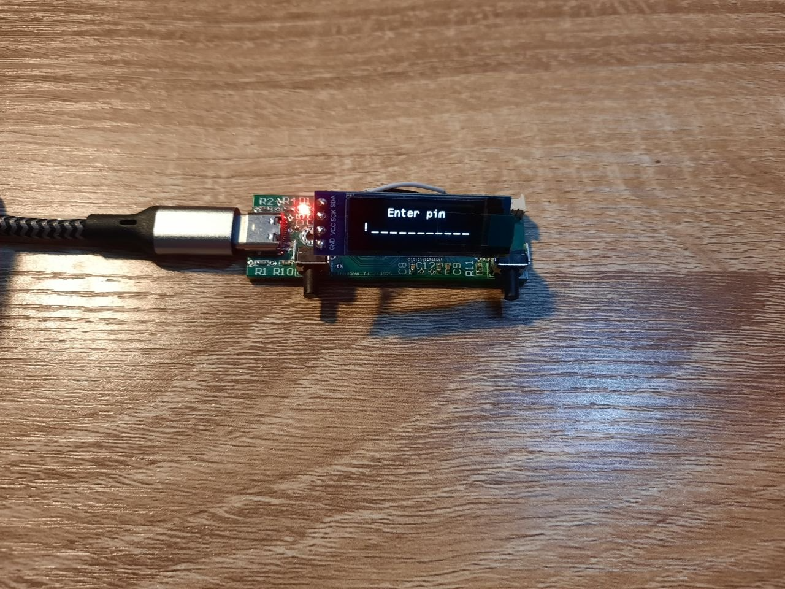
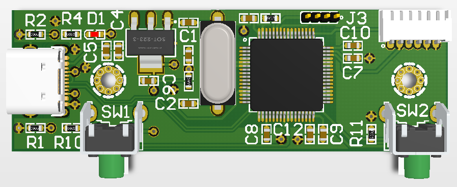
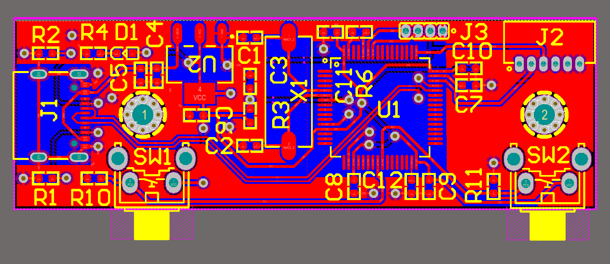
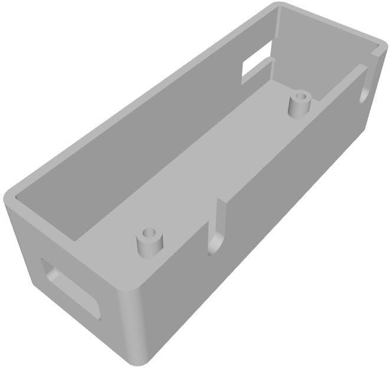
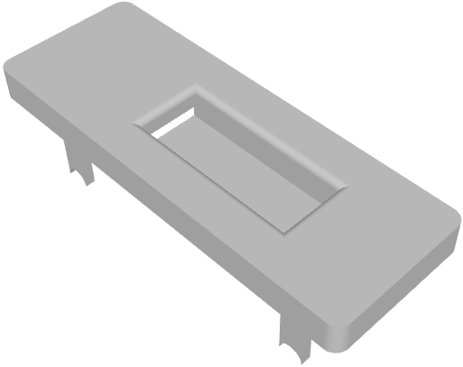

# SecureX

**SecureX** is a **hardware security module (HSM)** designed to provide secure, hardware-based encryption for files. It generates a unique **32-byte encryption key** for each file, ensuring strong data protection and preventing key reuse. To access the device and generate keys, users must authenticate using a **12-character password** directly on the hardware, adding an additional layer of security.

On the host computer, a **Python script** communicates with the SecureX hardware over a **USB-C interface**. This script manages file encryption and decryption by securely retrieving the hardware generated key and applying it to the selected files.

<p align="center">
  
</p>

---

## Contents
<!-- @import "[TOC]" {cmd="toc" depthFrom=2 depthTo=6 orderedList=false} -->

<!-- code_chunk_output -->
- [SecureX](#SecureX)
  - [Contents](#contents)
  - [Hardware](#Hardware)
    - [Overview](#Overview)
    - [User Interaction](#user-interaction)
    - [USB Commands](#usb-commands)
    - [Enrollment](#Enrollment)
    - [Unlock process](#Unlock-process)
    - [Key Generation Process](#key-generation-process)
  - [Software](#Software)
    - [Overview](#Overview)
    - [Features](#Features)
    - [Commands](#Commands)
      - [Examples](#Examples)
  - [PCB](#PCB)
  - [Case](#Case)

<!-- /code_chunk_output -->

## Hardware

### Overview
The **SecureX hardware** is a **hardware security module (HSM)** built with a **STM32 series microcontroller**. It performs all cryptographic operations, password hashing, key derivation, and AES encryption/decryption entirely within the device, ensuring that **no secret keys ever leave the hardware** in plaintext form.

The module includes the following main components:

- **Microcontroller (MCU):**  
  Handles cryptographic operations (SHA-256 and AES-CBC), user interface control, and USB communication with the host computer.

- **Internal Flash Memory:**  
  Used to securely store encrypted user credentials, salts, and master keys. All stored data is AES-encrypted and salted.

- **OLED Display:**  
  Provides visual feedback and menus for password entry, enrollment, and status information.

- **Two Push Buttons:**  
  Used for navigation and password entry. One button increases values (Up), the other decreases (Down), and pressing both confirms the input.

- **USB-C Interface:**  
  Enables communication between the hardware and the host system via a **Virtual COM Port (CDC)**.  
  The host sends and receives binary packets to check device status, lock/unlock, or request encryption keys.

When a file is encrypted or decrypted, the host only provides the **file ID** to hardware, the actual key is derived internally from the master key stored in protected memory. It supports up to 10 users and it means for the same ID each user generates different keys.The full source code of the SecureX firmware, is available in the [`Firmware/`](Firmware/) directory.

### User Interaction
The user interacts with the SecureX hardware through **two push buttons** and an **OLED display**. One button functions as **Up**, the other as **Down**, and pressing **both buttons simultaneously** acts as **Confirm/Select**.

During password entry, the user sets each character of the **12-character password** by increasing or decreasing its ASCII value using the Up and Down buttons. Pressing both buttons confirms the current character and moves to the next one.

Once the correct password is entered, the **main menu** appears on the OLED display, providing four options:
1. **Lock Device** – immediately locks the SecureX module.  
2. **Factory Reset** – securely erases all user data and resets the device.  
3. **Enroll New User** – allows adding a new user with a unique password.  
4. **Check Timeout** – displays the remaining time before the device automatically locks.

<p align="center">
  
</p>

The device automatically **locks after an inactivity timeout**, and this timeout can be viewed from the menu. If the user enters an incorrect password **three consecutive times**, the device’s memory is **erased** to protect sensitive data. In addition to manual interaction, the device also accepts a set of **USB commands** from the host computer, which are described in the next section.

---

### USB Commands

| Command | Code | Direction | Description |
|----------|------|------------|--------------|
| **STATUS** | `0x00` | Host → Device | Get lock state |
| **LOCK** | `0x01` | Host → Device | Lock device |
| **CRYPTO** | `0x02` | Host → Device | get 32-byte key |

### Enrollment

When the SecureX device connects to the USB port, it first **checks its internal flash memory**. If no user is found (i.e., the device is new or has been factory-reset), it generates a random **8-byte global salt** and stores it in memory. After this initialization, the device automatically enters the **Enrollment menu** to register the first user.

As mentioned earlier, each user must create a **12-character password**. Since each character can represent 96 possible ASCII values, there are **96¹² ≈ 4.7×10²³** unique password combinations making brute-force attacks practically infeasible, even if an attacker had full access to the microcontroller’s memory.

Once the user enters a valid 12-character password, the device performs the following cryptographic sequence:

1. **Hash and store password (with global salt)**  
   - The global salt is concatenated with the entered password:  
     ```
     combined = global_salt ‖ password
     ```
   - This combination is hashed using **SHA-256**, and the resulting 32-byte digest is stored in flash memory.  
   - The use of a global salt prevents **rainbow-table attacks**, ensuring that precomputed hash databases are ineffective.

2. **Generate salts and encrypt master key**  
   - The device generates:  
     - a random **8-byte local salt**,  
     - a random **16-byte master key**,  
     - and a random **16-byte initialization vector (IV)**.  
   - A **derived AES key** is then computed as:  
     ```
     derived_key = SHA-256(local_salt ‖ password)
     ```
   - The 16-byte master key is **encrypted using AES-CBC**, with `derived_key` and `IV`:  
     ```
     encrypted_master_key = AES_CBC_Encrypt(derived_key, IV, master_key)
     ```
   - The encrypted master key, IV, and local salt are saved to flash memory.

This design combines **strong password policies**, **per-user salting**, and **robust encryption algorithms**, ensuring a very high level of protection for the device’s internal data.

### Unlock process
1. User enters password.  
2. Device computes and verifies `SHA-256(global_salt ‖ password)`.  
3. If correct, it reconstructs `derived_key = SHA-256(local_salt ‖ password)` and decrypts the stored master key using AES-CBC.  
4. The decrypted **master key** is stored only in volatile memory (RAM) while unlocked.

<p align="center">
  
</p>

If the password is entered incorrectly **three times**, all flash memory is securely wiped and the device returns to a factory-new state.

---

### Key Generation Process
When the host sends a **CRYPTO (0x02)** command while device is unlocked:
1. The host provides a 9-byte **file ID** payload.  
2. The device combines this payload with the **user’s master key** using a byte-add-with-carry algorithm.  
3. It hashes the result using **SHA-256** to produce a **32-byte key**.  
4. The key is returned to the host for file encryption or decryption.

This ensures:
- Keys are **unique per file** and **per user**.  
- Identical file IDs across users produce different keys.

---

## Software

### Overview

The SecureX software is a **Python command-line utility** that communicates with the hardware module via USB. It retrieves hardware-generated encryption keys and applies **AES-256-CBC** encryption and decryption on files. The source code of the pythons script, can be found in the [`Python/`](Python/) directory. 

---

### Features
- Automatic device detection via USB serial  
- Secure 32-byte AES key retrieval from hardware  
- Unique 9-byte file ID from SHA-256(file content)  
- AES-256-CBC with PKCS#7 padding  
- Custom 29-byte file header (`MAGIC | VERSION | ID | IV`)  

---

### Commands

| Command | Description |
|----------|-------------|
| `status` | Check device state |
| `lock` | Lock the device manually |
| `encrypt <file>` | Encrypt a file using SecureX |
| `decrypt <file.enc>` | Decrypt a file |
| `help` | Display usage help |

#### Examples
```bash
python3 SecureX.py status
python3 SecureX.py encrypt Filename
python3 SecureX.py decrypt Filename.enc
python3 SecureX.py lock
```
<p align="center">
  
</p>

## PCB
A custom **PCB** was designed for this project. The PCB layout and its complete schematic can be found in the [`PCB/`](PCB/) directory.

<p align="center">
  
</p>

<p align="center">
  
</p>

---

## Case
A **custom enclosure** was also designed for the SecureX device. All 3D design files and renders are available in the [`Case/`](Case/) directory.


<p align="center">
  
</p>

<p align="center">
  
</p>